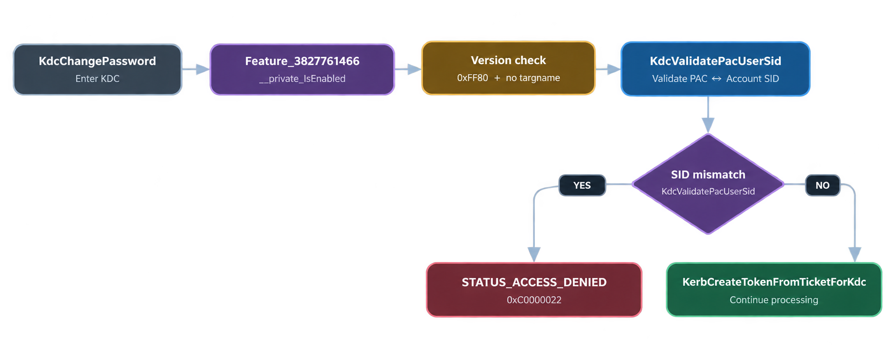

# ResetNightmare

**ResetNightmare**, [CVE-2026-27912](https://msrc.microsoft.com/update-guide/vulnerability/CVE-2026-27912), fue descubierta por **Shai Laron**, investigador de [Semperis](https://www.linkedin.com/company/semperis/). Más información en [@SemperisTech](https://x.com/semperistech).

## Mini análisis de ingeniería inversa sobre `kdcsvc.dll`

El laboratorio se ejecuta desde `jellybeelab\rn-low`. El cliente utiliza `rn-controlled` como cuenta controlada, conozco su contraseña y puedo modificar su `userPrincipalName`. El objetivo es `rn-target`, una cuenta distinta perteneciente a **Domain Admins**, cuya contraseña inicial no conozco.


https://github.com/user-attachments/assets/18e614c8-07c0-42df-85c9-64668bb3781a


Durante la ejecución asigno temporalmente `rn-target` como `userPrincipalName` de `rn-controlled` y solicito al KDC un ticket Kerberos para `kadmin/changepw` mediante `NT-ENTERPRISE`. Una vez obtenido el ticket elimino el UPN temporal, por lo que `rn-target` vuelve a resolver a la cuenta objetivo mientras el ticket conserva el nombre utilizado durante su emisión.


*Figura 1 — El nombre Kerberos permanece `rn-target`, mientras el SID contenido en el PAC y el SID de la cuenta resuelta por el KDC corresponden a objetos distintos.*

La petición de cambio de contraseña utiliza `KRB_KPASSWD_VERSION = 0xFF80`. `ChangePasswdData` contiene únicamente `newpasswd`, sin `targname` ni `targrealm`.

Para localizar el cambio dentro del KDC comparo dos versiones de `kdcsvc.dll` de Windows Server 2022:

- `10.0.20348.4893`
- `10.0.20348.5020`

Ambas muestras se reconstruyen de forma independiente desde `kdcsvc.dll 10.0.20348.1` utilizando los deltas PA30 de `KB5078766` y `KB5082142`. Los binarios resultantes son PE32+ AMD64 de `876544` bytes y sus PDB públicos permiten recuperar símbolos, tipos y RVA durante el análisis.

El diff concentra rápidamente la atención en `KdcChangePassword`. Entre ambas versiones la función cambia de RVA `0x7A090` a `0x7A0A0`, aumenta de 4005 a 4079 bytes, pasa de 159 a 163 bloques básicos y de 858 a 873 instrucciones.

En `.5020` aparece una rama adicional inmediatamente antes de `KerbCreateTokenFromTicketForKdc`:

```asm
0x18007ADB3  lea   rcx, [Feature_3827761466]
0x18007ADBA  call  Feature_3827761466::__private_IsEnabled
0x18007ADBF  mov   sil, byte [rbp-0x7c]
0x18007ADC3  test  al, al
0x18007ADC5  je    continuar
0x18007ADC7  test  sil, sil
0x18007ADCA  jne   continuar
0x18007ADCC  mov   rcx, qword [rbp-0x70]
0x18007ADD0  lea   rdx, [rbp+0xd0]
0x18007ADD7  call  KdcValidatePacUserSid
0x18007ADDF  test  eax, eax
0x18007ADE1  je    continuar
0x18007ADE3  mov   ebx, 0xC0000022
0x18007ADE8  jmp   salida_error
0x18007AEAA  call  KerbCreateTokenFromTicketForKdc
```

La llamada a `KdcValidatePacUserSid` aparece antes de `KerbCreateTokenFromTicketForKdc`. Si `KdcValidatePacUserSid` devuelve un valor distinto de cero, `KdcChangePassword` carga `0xC0000022`, correspondiente a `STATUS_ACCESS_DENIED`, y transfiere el control a la ruta de error.



*Figura 3 — `KdcValidatePacUserSid` se ejecuta antes de `KerbCreateTokenFromTicketForKdc`, un resultado no nulo deriva el flujo hacia `STATUS_ACCESS_DENIED`.*

IDA resuelve la llamada como `wil::details::FeatureImpl<__WilFeatureTraits_Feature_3827761466>::__private_IsEnabled` y muestra un `CODE XREF` desde `KdcChangePassword`. El valor devuelto en `AL` se comprueba inmediatamente mediante `test al, al`, y condiciona la entrada a la rama donde posteriormente se evalúa `KdcValidatePacUserSid`.


*Figura 4 — `Feature_3827761466::__private_IsEnabled` y su referencia desde `KdcChangePassword`.*

Sigo la variable local que condiciona la llamada. En el flujo anterior, `[rbp-0x7c]` se inicializa a partir de la condición `version == 0xFF80` y se actualiza cuando `ChangePasswdData` no contiene `targname`. La petición reproducida utiliza `0xFF80` y no incluye `targname` ni `targrealm`, con ese estado, el flujo alcanza la llamada a `KdcValidatePacUserSid`.

Entro en `KdcValidatePacUserSid`.


IDA identifica la función con dos parámetros tipados: `KERB_ENCRYPTED_TICKET` y `_KDC_TICKET_INFO`.


*Figura 5 — Firma decompilada y estructuras locales al entrar en `KdcValidatePacUserSid`.*

En `20348.5020` :

```asm
0x180048827  call  KerbGetPacFromAuthData
0x18004884E  call  PAC_UnMarshal
0x180048887  call  PAC_Find
0x18004891A  call  PAC_UnmarshallValidationInfo
0x180048937  mov   edx, dword [rdi+0x94]
0x18004893D  mov   rcx, qword [rdi+0xE0]
0x180048944  call  PAC_MakeDomainRelativeSid
0x18004897A  mov   edx, dword [r14+0x30]
0x180048982  call  KdcMakeAccountSid
0x18004898E  call  RtlEqualSid
0x18004899A  test  al, al
```


En el bloque inicial, `rcx` se carga desde `[r15+0xA0]` y entra en `KerbGetPacFromAuthData`. Tras comprobar el estado y el puntero devuelto, el código recupera el tamaño desde `[rcx+0x10]`, conserva el objeto y llama a `PAC_UnMarshal`.


*Figura 6 — Preparación del argumento, `KerbGetPacFromAuthData`, validación del retorno y llamada posterior a `PAC_UnMarshal`.*

La siguiente llamada reduce todavía más la ambigüedad. IDA carga `edx = 1` antes de `PAC_Find`. Según MS-PAC, `PAC_INFO_BUFFER.ulType = 0x00000001` identifica **Logon Information**, cuyo contenido serializado es `KERB_VALIDATION_INFO`.


*Figura 7 — `PAC_Find` recibe explícitamente el tipo `1`, el resultado se conserva, se valida y su tamaño se utiliza después para reservar una copia del buffer.*

Sigo ese buffer. `PAC_UnmarshallValidationInfo` produce la estructura de validación y, justo después, aparecen dos valores que terminan juntos en `PAC_MakeDomainRelativeSid`: un DWORD cargado desde `[rdi+0x94]` y el puntero anotado por IDA como `SourceSid` desde `[rdi+0xE0]`.

Estos `KERB_VALIDATION_INFO`: `UserId` y `LogonDomainId` forman la información necesaria para reconstruir el SID del cliente.


*Figura 8 — Tras `PAC_UnmarshallValidationInfo`, los datos de la estructura terminan en `PAC_MakeDomainRelativeSid`.*

El retorno de `PAC_MakeDomainRelativeSid` queda en `rsi`. En este momento ya tengo el primer operando que estaba buscando: un SID derivado de la información transportada por el PAC. En la ejecución positiva, esa información se originó cuando `rn-target` todavía resolvía a `rn-controlled`.

Ahora sigo el segundo camino.

`KdcValidatePacUserSid` carga otro identificador desde `_KDC_TICKET_INFO` y llama a `KdcMakeAccountSid`. Para evitar atribuirle semántica únicamente por el nombre, abro el helper.

Dentro de `KdcMakeAccountSid`, `edx` se conserva en `edi`. La función obtiene la longitud de `GlobalDomainSid`, copia el SID del dominio al buffer de salida, consulta `RtlSubAuthorityCountSid`, localiza la siguiente subautoridad con `RtlSubAuthoritySid`, escribe `edi` en esa posición y aumenta el contador de subautoridades.


*Figura 9 — `KdcMakeAccountSid` construye un SID de cuenta extendiendo `GlobalDomainSid` con el identificador recibido en su segundo argumento.*

 Uno nace del Logon Information del PAC, el otro se construye desde el contexto de cuenta que el KDC está procesando.

Vuelvo al caller y los encuentro consecutivamente:

```asm
0x18004897A  mov   edx, [r14+30h]
0x18004897E  lea   rcx, [rbp+...+Sid2]
0x180048982  call  KdcMakeAccountSid
0x180048987  lea   rdx, [rbp+...+Sid2]
0x18004898B  mov   rcx, rsi
0x18004898E  call  RtlEqualSid
0x18004899A  test  al, al
```

`rsi` conserva el SID que viene de `PAC_MakeDomainRelativeSid`. `Sid2` acaba de ser construido por `KdcMakeAccountSid`. En la llamada ambos entran directamente en `RtlEqualSid`.


*Figura 10 — `rcx = rsi`, `rdx = &Sid2`, llamada a `RtlEqualSid` y prueba inmediata del resultado.*


```c
if ( !RtlEqualSid(DomainRelativeSid, Sid2) )
{
    ...
}
```


Durante la emisión, el nombre `rn-target` estaba asociado a `rn-controlled`, por lo que la identidad contenida en la información de autorización procede de esa cuenta. Después retiro el UPN temporal y `rn-target` vuelve a resolver al objeto objetivo. 


*Figura 12 — El SID derivado del Logon Information y el SID construido desde el contexto de cuenta convergen en `RtlEqualSid`.*

La ruta de cambio de contraseña ya no depende únicamente de que el nombre del ticket siga siendo válido. Antes de llegar a `KerbCreateTokenFromTicketForKdc`, `.5020` fuerza una comprobación de identidad entre el SID del PAC y el SID de la cuenta que el KDC ha resuelto.

El PoC publicado por Semperis sigue la misma transición de estado: escribe temporalmente el UPN de una cuenta controlada con el `sAMAccountName` del objetivo, solicita la credencial mediante `NT-ENTERPRISE` para `kadmin/changepw`, elimina el UPN y utiliza la credencial para cambiar la contraseña. Mi cliente reproduce esa secuencia directamente en C mediante LDAP, Kerberos, ASN.1, criptografía y RFC 3244.

A partir de aquí, `KdcChangePassword` llama a `KdcValidatePacUserSid`, la función extrae Logon Information del PAC, reconstruye un SID, construye el SID de la cuenta resuelta y los enfrenta en `RtlEqualSid`. Si no coinciden, el caller convierte el fallo en `STATUS_ACCESS_DENIED` antes de `KerbCreateTokenFromTicketForKdc`.

## Referencias

- [CVE.org — CVE-2026-27912](https://www.cve.org/CVERecord?id=CVE-2026-27912)
- [Microsoft Security Response Center — CVE-2026-27912](https://msrc.microsoft.com/update-guide/vulnerability/CVE-2026-27912)
- [Semperis-Community — ResetNightmare](https://github.com/Semperis-Community/ResetNightmare)
- [Semperis — Identity Crisis / ResetNightmare](https://www.semperis.com/blog/identity-crisis-novel-vulnerabilities-leading-to-kerberos-downgrade-dos-and-full-domain-takeover/)
- [RFC 3244](https://www.rfc-editor.org/rfc/rfc3244)
- [MS-PAC — PAC_INFO_BUFFER](https://learn.microsoft.com/en-us/openspecs/windows_protocols/ms-pac/3341cfa2-6ef5-42e0-b7bc-4544884bf399)
- [MS-PAC — KERB_VALIDATION_INFO](https://learn.microsoft.com/en-us/openspecs/windows_protocols/ms-pac/69e86ccc-85e3-41b9-b514-7d969cd0ed73)
- [KB5078766 — Windows Server 2022, OS Build 20348.4893](https://support.microsoft.com/en-us/servicing/os/windows-server/2026/03/march-10-2026-kb5078766-os-build-20348-4893)
- [KB5082142 — Windows Server 2022, OS Build 20348.5020](https://support.microsoft.com/en-us/servicing/os/windows-server/2026/04/april-14-2026-kb5082142-os-build-20348-5020)
