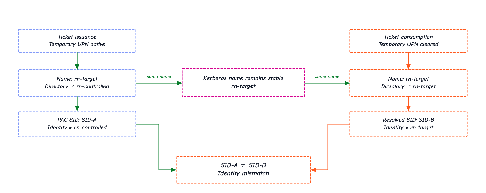
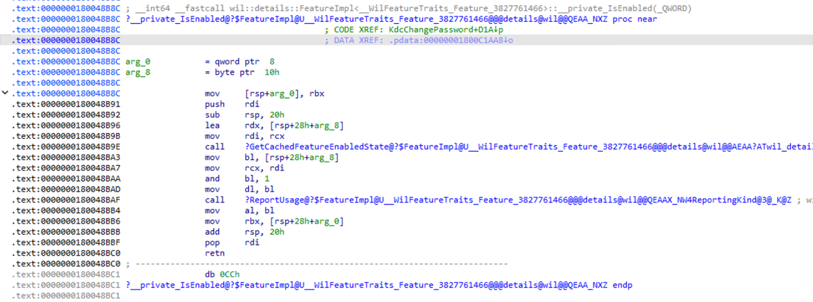
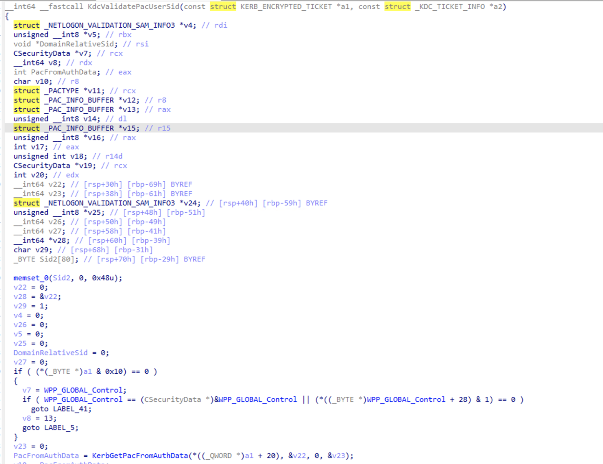
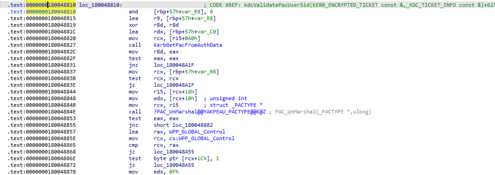
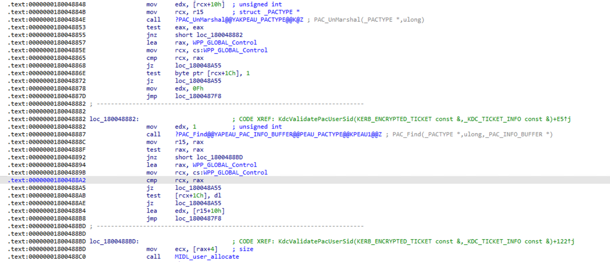
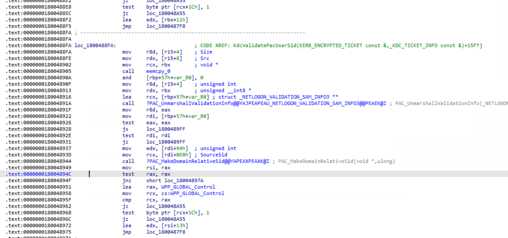
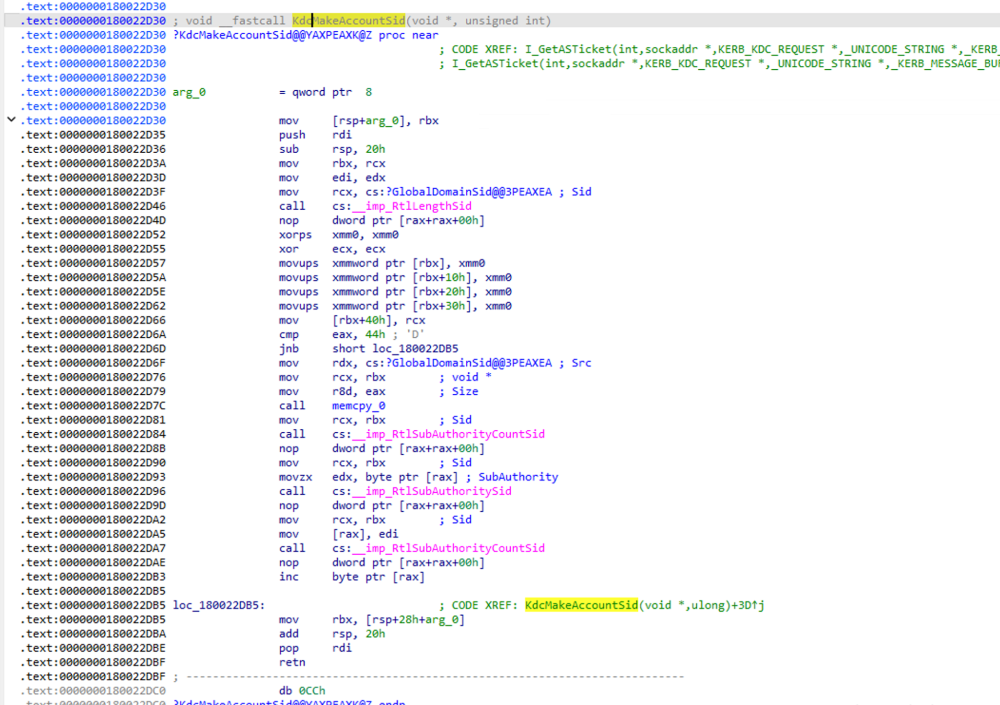
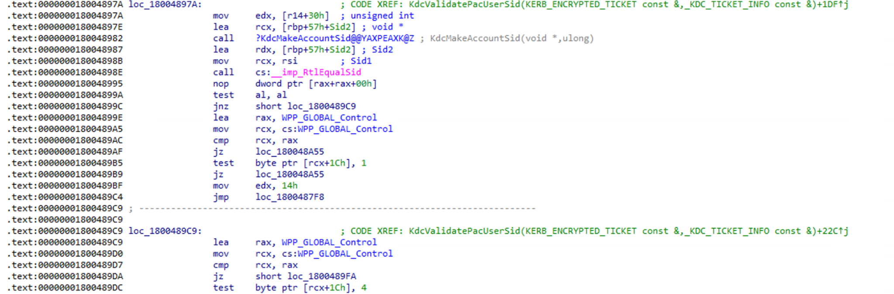
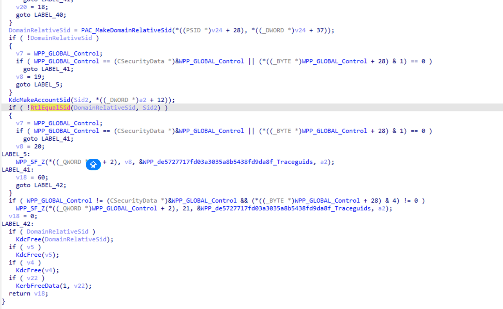
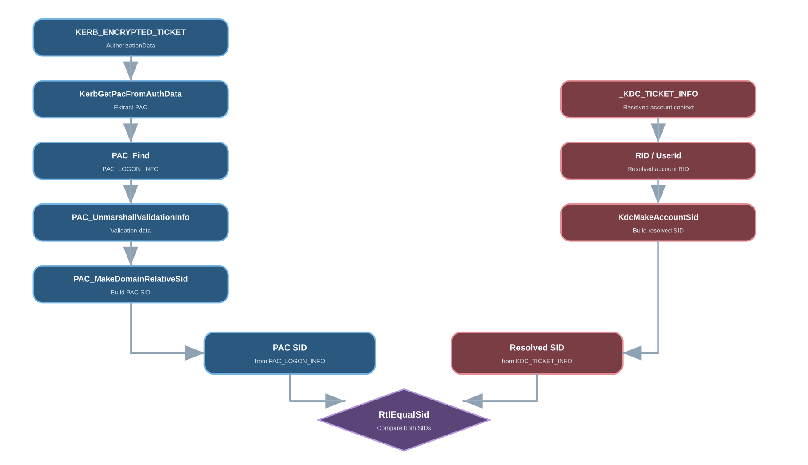

# ResetNightmare

**ResetNightmare**, [CVE-2026-27912](https://msrc.microsoft.com/update-guide/vulnerability/CVE-2026-27912), fue descubierta por **Shai Laron**, investigador de [Semperis](https://www.linkedin.com/company/semperis/). Más información en [@SemperisTech](https://x.com/semperistech).


## Modo de uso

El PoC se compila para Windows x64 mediante MinGW-w64. El `Makefile` genera `resetnightmare_rajkitpoc.exe`.

```bash
cd POC
make
```
La sintaxis soportada por el cliente es:

```powershell
.\resetnightmare_rajkitpoc.exe `
    --t <target-account> `
    --u <controlled-account> `
    --controlled-password <controlled-password> `
    --new-target-password <new-target-password> `
    --d <domain-controller> `
    --e AES256 `
    --execute
```

| Parámetro | Descripción |
|---|---|
| `--t` | Cuenta objetivo |
| `--u` | Cuenta controlada cuyo `userPrincipalName` puede modificarse |
| `--controlled-password` | Contraseña de la cuenta controlada |
| `--new-target-password` | Nueva contraseña destinada a la cuenta objetivo |
| `--d` | Controlador de dominio, si se omite el cliente intenta descubrirlo automáticamente |
| `--e` | Tipo de cifrado, `AES256`, `AES128` o `RC4` |
| `--execute` | Habilita la ejecución del flujo |
| `--print-Ticket` | Muestra el `KRB-CRED` obtenido durante la ejecución |


## Mini análisis de ingeniería inversa sobre `kdcsvc.dll`

La prueba se ejecuta desde `jellybeelab\rn-low`. El cliente utiliza `rn-controlled` como cuenta controlada, conozco su contraseña y puedo modificar su `userPrincipalName`. El objetivo es `rn-target`, una cuenta distinta perteneciente a **Domain Admins**, cuya contraseña inicial no conozco.

<video
  src="./assets/resetnightmare-positive-evidence.mp4"
  poster="./assets/resetnightmare-video-poster.png"
  controls
  preload="auto"
  playsinline
  width="100%">
</video>

Durante la ejecución asigno temporalmente `rn-target` como `userPrincipalName` de `rn-controlled` y solicito al KDC un ticket Kerberos para `kadmin/changepw` mediante `NT-ENTERPRISE`. Una vez obtenido el ticket elimino el UPN temporal, por lo que `rn-target` vuelve a identificar a la cuenta objetivo mientras el ticket mantiene el nombre utilizado durante su emisión.



*Figura 1 — El nombre Kerberos permanece `rn-target`, mientras la identidad transportada por el PAC y la identidad asociada al nombre después de retirar el alias corresponden a objetos distintos.*

La petición de cambio de contraseña utiliza `KRB_KPASSWD_VERSION = 0xFF80`. `ChangePasswdData` contiene únicamente `newpasswd`, sin `targname` ni `targrealm`.

Para el análisis comparo dos muestras de Windows Server 2022:

- `10.0.20348.4893`, correspondiente a `KB5078766`
- `10.0.20348.5020`, correspondiente a `KB5082142`

Microsoft documenta `20348.4893` como la compilación de Windows Server 2022 publicada con `KB5078766` y `20348.5020` como la compilación publicada con `KB5082142`. El registro oficial de CVE identifica Windows Server 2022 desde `10.0.20348.0` hasta versiones anteriores a `10.0.20348.5020` como afectado.

### `KdcChangePassword`

En la muestra `20348.5020`, IDA muestra el siguiente bloque dentro de `KdcChangePassword`:

```asm
.text:000000018007ADB3 loc_18007ADB3:                          ; CODE XREF: KdcChangePassword+CD3↑j
.text:000000018007ADB3                 lea     rcx, ?impl@?1??GetImpl@?$Feature@U__WilFeatureTraits_Feature_3827761466@@@wil@@CAAEAV?$FeatureImpl@U__WilFeatureTraits_Feature_3827761466@@@details@3@XZ@4V453@A
.text:000000018007ADBA                 call    ?__private_IsEnabled@?$FeatureImpl@U__WilFeatureTraits_Feature_3827761466@@@details@wil@@QEAA_NXZ
.text:000000018007ADBF                 mov     sil, byte ptr [rbp+3F0h+var_46C]
.text:000000018007ADC3                 test    al, al
.text:000000018007ADC5                 jz      short loc_18007ADED
.text:000000018007ADC7                 test    sil, sil
.text:000000018007ADCA                 jnz     short loc_18007ADED
.text:000000018007ADCC                 mov     rcx, [rbp+3F0h+var_460] ; struct KERB_ENCRYPTED_TICKET *
.text:000000018007ADD0                 lea     rdx, [rbp+3F0h+var_320] ; struct _KDC_TICKET_INFO *
.text:000000018007ADD7                 call    ?KdcValidatePacUserSid@@YAJAEBUKERB_ENCRYPTED_TICKET@@AEBU_KDC_TICKET_INFO@@@Z
.text:000000018007ADDC                 mov     [rbp+3F0h+var_470], eax
.text:000000018007ADDF                 test    eax, eax
.text:000000018007ADE1                 jz      short loc_18007ADED
.text:000000018007ADE3                 mov     ebx, 0C0000022h
.text:000000018007ADE8                 jmp     loc_18007A8DF
.text:000000018007ADED loc_18007ADED:
```

IDA resuelve el feature como `wil::details::FeatureImpl<__WilFeatureTraits_Feature_3827761466>::__private_IsEnabled`. El bloque comprueba el valor devuelto en `AL` y después el valor cargado en `sil`. Cuando ambas condiciones permiten continuar, `rcx` recibe un `KERB_ENCRYPTED_TICKET` y `rdx` apunta a una estructura `_KDC_TICKET_INFO`, ambos argumentos se pasan a `KdcValidatePacUserSid`.

El retorno de `KdcValidatePacUserSid` se almacena en `var_470` y se comprueba inmediatamente mediante `test eax, eax`. Un retorno igual a cero alcanza `loc_18007ADED`. Un retorno distinto de cero carga `0xC0000022`, correspondiente a `STATUS_ACCESS_DENIED`, en `ebx` y transfiere el control a `loc_18007A8DF`.



*Figura 2 — IDA muestra `Feature_3827761466::__private_IsEnabled` y un `CODE XREF` desde `KdcChangePassword`.*

El fragmento confirma también que `sil` se carga desde `[rbp+3F0h+var_46C]` y actúa como una segunda condición antes de `KdcValidatePacUserSid`.

### `KdcValidatePacUserSid`

El símbolo demanglado de la llamada identifica la función como:

```cpp
KdcValidatePacUserSid(
    KERB_ENCRYPTED_TICKET const &,
    _KDC_TICKET_INFO const &
)
```

Hex-Rays representa esos argumentos como punteros a `KERB_ENCRYPTED_TICKET` y `_KDC_TICKET_INFO`, una representación equivalente a nivel de ABI para las referencias C++ observadas en el símbolo.



*Figura 3 — Firma decompilada y estructuras locales visibles al entrar en `KdcValidatePacUserSid`.*

Dentro de `KdcValidatePacUserSid`, las capturas de IDA muestran esta secuencia:

```asm
0x180048827  call  KerbGetPacFromAuthData
0x18004884E  call  PAC_UnMarshal
0x180048887  call  PAC_Find
0x18004891A  call  PAC_UnmarshallValidationInfo
0x180048937  mov   edx, dword [rdi+0x94]
0x18004893D  mov   rcx, qword [rdi+0xE0]
0x180048944  call  PAC_MakeDomainRelativeSid
0x18004897A  mov   edx, dword [r14+0x30]
0x180048982  call  KdcMakeAccountSid
0x18004898E  call  RtlEqualSid
0x18004899A  test  al, al
```

En el primer bloque, `rcx` se carga desde `[r15+0xA0]` antes de `KerbGetPacFromAuthData`. Después de comprobar el estado y el puntero devuelto, el código carga el tamaño desde `[rcx+0x10]` y llama a `PAC_UnMarshal`.



*Figura 4 — `KerbGetPacFromAuthData`, comprobaciones del retorno y llamada posterior a `PAC_UnMarshal`.*

A continuación IDA carga `edx = 1` antes de `PAC_Find`. Según [MS-PAC](https://learn.microsoft.com/en-us/openspecs/windows_protocols/ms-pac/3341cfa2-6ef5-42e0-b7bc-4544884bf399), `PAC_INFO_BUFFER.ulType = 0x00000001` identifica **Logon Information**, cuyo contenido serializado corresponde a [`KERB_VALIDATION_INFO`](https://learn.microsoft.com/en-us/openspecs/windows_protocols/ms-pac/69e86ccc-85e3-41b9-b514-7d969cd0ed73).



*Figura 5 — `PAC_Find` recibe explícitamente el tipo `1`, el resultado se conserva y se valida antes de continuar.*

`PAC_UnmarshallValidationInfo` produce la estructura de validación. Después IDA carga un DWORD desde `[rdi+0x94]` y un puntero desde `[rdi+0xE0]`, este último aparece anotado como `SourceSid` en la llamada a `PAC_MakeDomainRelativeSid`.

MS-PAC define `UserId` y `LogonDomainId` dentro de `KERB_VALIDATION_INFO`, y especifica que `LogonDomainId` junto con `UserId` se utiliza para construir el SID del cliente.



*Figura 6 — Los datos deserializados terminan en `PAC_MakeDomainRelativeSid`.*

El retorno de `PAC_MakeDomainRelativeSid` se conserva en `rsi`.

El segundo camino carga un DWORD desde `[r14+0x30]` y lo pasa como segundo argumento a `KdcMakeAccountSid`.

Al abrir `KdcMakeAccountSid`, IDA muestra que el segundo argumento se conserva en `edi`. La función obtiene la longitud de `GlobalDomainSid`, copia el SID del dominio, consulta `RtlSubAuthorityCountSid`, localiza una subautoridad mediante `RtlSubAuthoritySid`, escribe `edi` en esa posición y aumenta el contador de subautoridades.



*Figura 7 — `KdcMakeAccountSid` construye un SID extendiendo `GlobalDomainSid` con el valor recibido en su segundo argumento.*

Los dos caminos convergen inmediatamente antes de `RtlEqualSid`:

```asm
0x18004897A  mov   edx, [r14+30h]
0x18004897E  lea   rcx, [rbp+...+Sid2]
0x180048982  call  KdcMakeAccountSid
0x180048987  lea   rdx, [rbp+...+Sid2]
0x18004898B  mov   rcx, rsi
0x18004898E  call  RtlEqualSid
0x18004899A  test  al, al
```

`rsi` contiene el retorno de `PAC_MakeDomainRelativeSid` y `rdx` apunta a `Sid2`, construido por `KdcMakeAccountSid`.



*Figura 8 — `rcx = rsi`, `rdx = &Sid2`, llamada a `RtlEqualSid` y comprobación inmediata del resultado.*

La vista de Hex-Rays muestra la condición:

```c
if ( !RtlEqualSid(DomainRelativeSid, Sid2) )
{
    ...
}
```



*Figura 9 — La desigualdad de los SID selecciona la rama de error dentro de `KdcValidatePacUserSid`.*

En la secuencia, el ticket se obtiene mientras `rn-target` está asignado temporalmente como UPN de `rn-controlled`. Tras retirar ese UPN, `rn-target` vuelve a identificar a la cuenta objetivo. El análisis de `KdcValidatePacUserSid` muestra una comparación explícita entre el SID derivado de la información del PAC y un segundo SID construido mediante `KdcMakeAccountSid`.



*Figura 10 — Resumen del flujo observado dentro de `KdcValidatePacUserSid` hasta la comparación mediante `RtlEqualSid`.*

El PoC oficial de Semperis reproduce la misma transición de identidad, establece temporalmente el UPN de una cuenta controlada con el `sAMAccountName` del objetivo, solicita el ticket con `NT-ENTERPRISE` para `kadmin/changepw`, elimina el UPN temporal y utiliza posteriormente ese ticket para cambiar la contraseña del objetivo.

En el laboratorio, la operación termina con `kpasswd = 0x0000` y la autenticación posterior utiliza la nueva contraseña de `rn-target`.

## Referencias

- [Microsoft Security Response Center — CVE-2026-27912](https://msrc.microsoft.com/update-guide/vulnerability/CVE-2026-27912)
- [CVE.org — CVE-2026-27912](https://www.cve.org/CVERecord?id=CVE-2026-27912)
- [Semperis-Community — ResetNightmare](https://github.com/Semperis-Community/ResetNightmare)
- [Semperis — Shai Laron y ResetNightmare](https://www.semperis.com/es/press-release/semperis-takes-center-stage-at-black-hat-usa/)
- [RFC 3244 — Kerberos Change Password and Set Password Protocols](https://www.rfc-editor.org/rfc/rfc3244)
- [MS-PAC — PAC_INFO_BUFFER](https://learn.microsoft.com/en-us/openspecs/windows_protocols/ms-pac/3341cfa2-6ef5-42e0-b7bc-4544884bf399)
- [MS-PAC — KERB_VALIDATION_INFO](https://learn.microsoft.com/en-us/openspecs/windows_protocols/ms-pac/69e86ccc-85e3-41b9-b514-7d969cd0ed73)
- [KB5078766 — Windows Server 2022, OS Build 20348.4893](https://support.microsoft.com/help/5078766)
- [KB5082142 — Windows Server 2022, OS Build 20348.5020](https://support.microsoft.com/help/5082142)
